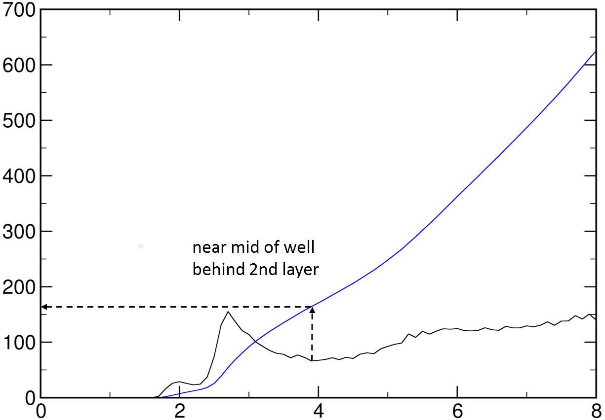
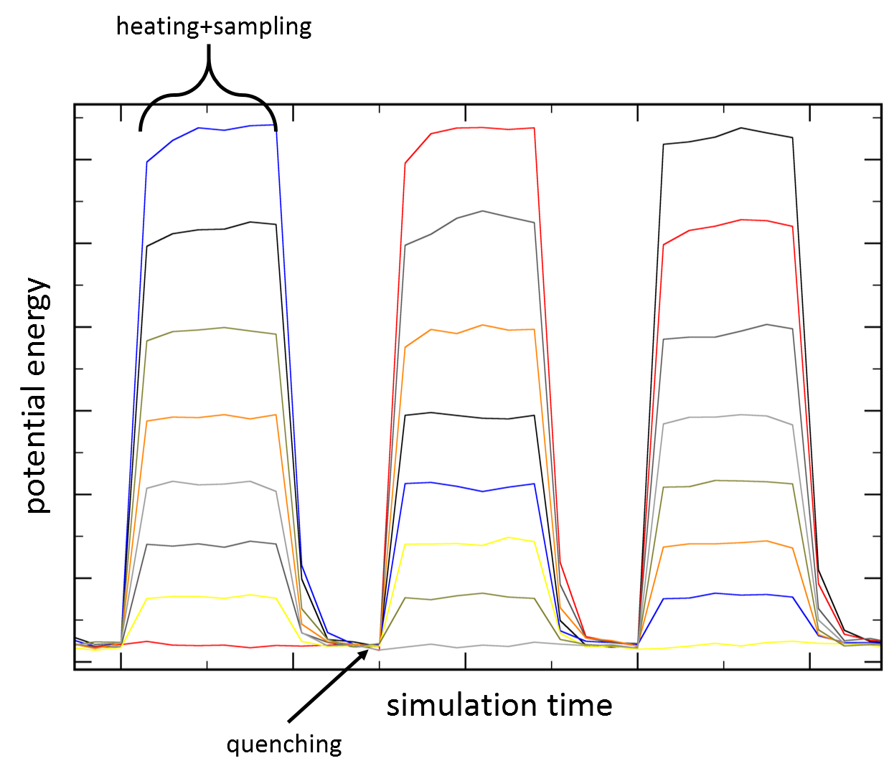

## TIGER2hsPE application on your own system

Example systems for (AAQAA)3, HP7 and TrpCage are availabe. Additional practical information to run other molecular systems is the scope of this small tutorial. A minor working experience with NAMD and VMD should be present and also knowledge on building systems and topologies. All instruction were derived under a Linux environment.

### Now uses OpenMM

Our latest TIGER2hs implementation relies on OpenMM and MDAnalysis for the hybrid solvent energy calculation. OpenMM and dependencies are best installed into a seperate python environment using *Anaconda*

    conda create -n t2hs_openmm python=3.7
    conda activate t2hs_openmm
    conda install -c conda-forge openmm mdanalysis
    
To run TIGER2hs, activate your conda environment from the jobscript (e.g. `template.sh`)

    conda activate t2hs_openmm

### General concept of multi-copy algorithms in NAMD

In NAMD, multi-copy based algorithms use a TCL API that allows sending messages between copies (replicas) of a simulation. Multiple instances of the same simulation are started with the +replicas flag and utilize an individual portion of the computational resources. This allows efficient parallel scaling, since each replica runs as an individual simulation. Only small amounts of communication and synchronization takes place between replicas. Using this concept, a variety of replica based algorithms can be implemented with a production ready performance and workflow, suitable to run on GPU enabled personal computers or on large computing facilities. A multi-copy enabled NAMD version is required, which can be built from source or downloaded pre-compiled from the NAMD website.

### Concept of configuration files and job launching

The implementation of REMD which was first shipped with NAMD version 2.10 used a concept of various configuration files, which was adopted for out implementations:

| File           | Description|
|----------------|------------|
| jobX.conf      | A job based scheme is used to realize REMD simulations in multiple chunks with the ability of continuation. The first job has X=0 and each following restart increases the number by one. This job configuration references the remd.conf and replica.namd files. For X>0, it references also a restart.tcl file, to continue the sampling from the previous job. |
| remd.conf      | This file holds specific settings for the sampling algorithm implemented in replica_*.namd such as             the number of replicas or the temperature range.|
| replica_*.namd | This is the major file holding the implementation of the multi-copy algorithm. Available             configuration options and usage hints are explained at the header of the file.|
| base.namd      | The essential simulation settings for NAMD that is used by the replicas during the sampling. Some settings are excluded and they are set by replica.namd, such as the thermostat temperature, or the number of simulation steps to run.|

These files are now generated by the `template.sh` given in each implementation folder (`src/...`). Together with these files, the molecular system is required that contains the force field parameters and initial coordinates. In this study we used the AMBER force field and therefore a system topology of Parm7 format and the initial coordinates (PDB) are required. For sampling algorithms that utilize the hybrid solvent scheme, the molecular system files must also be prepared for the hybrid system, where only the solute and optionally a number of water molecules are present. Generally, the sampling algorithms do not rely on the AMBER force field. Any force field that is supported by NAMD and OpenMM can be used, such as CHARMM. Therefore, one would .e.g require a PSF instead of Parm7 file and change the settings in `template.sh` accordingly, to hold the respective settings to enable CHARMM files. Specifically this would replace the AMBER typical settings:

    amber on
    parmfile system.top
    [...]
    1-4scaling 0.8333
    
with the settings enabling CHARMM:

    structure system.psf
    parameters ff.prm
    [...]
    1-4scaling 1
    
Also the OpenMM script `tigeromm` is changed from `remd/omm_impl_spe.py` to `remd/omm_impl_spe_charmm.py`.

### Preparing and running a TIGER2hs sampling simulation for a solute of own interest.
--- TIGER2hs configuration options (remd.conf)

| Option                 |  Description |
|------------------------|--------------|
| num_replicas           |  Number of replicas |
| min_temp               |  Temperature of interest for the baseline sampling. |
| max_temp               |  Highest sampling temperature (to adjust dT/X |
| tigerheat              |  Tiger2 heating phase length [steps (normally included in sampling phase |
| tigersample            |  Tiger2 sampling phase [steps]. Usually a multiple of tigerquench to keep the fraction of quenching time vs. overall sampling low.|
| tigerquench            |  Tiger2 quenching phase [steps]. Must be long enough to allow fair equilibration of all replicas to baseline temperature, especially with NPT. |
| tigersolute            |  Resid range selection for the solute in the hybrid solvent approach: e.g. the protein (example: 1-4,6,8,9-10) |
| tigersolvent           |  Resid range selection for the solvent in the hybrid solvent approach: e.g. the water |
| tigerignore            |  Optional resid range selection for parts of tigersolute, that should not enter the shell search |
| tigershell             |  Number of solvent molecules in the solvation shell. |
| tigerspace             |  Domain size [Angstrom] for the domain decomposition during the solvation shell search. Must be set large enough, so that at least the specified amount of solvent molecules is safely found, e.g. twice as much as tigershell. Should be tuned as small as possible for performance reason (s. tools/tiger2hs_shellcheck.tcl) |
| tigerconheat           | 1=enabled; 0=disabled Enable continues heating mod. | 
| tigeromm               | Path to OpenMM script evaluating the continuum solvent energy. |
| tigerimplgb            | Implicit solvent model [HCT, OBC1, OBC2, GBn, GBn2] |
| tigerimplsaltcon       | Implicit solvent salt concentration |
| tigerimplpbc           | 1=enabled; 0=disabled Periodic boundary conditions during hybrid solvent step.|
| tigerimpltop           | Topology file for reduced system |
| tigerimplplatform      | OpenMM platform used for energy calculation [CPU, CUDA, OpenCL] |
| ommpre                 | Command prefix for OpenMM script call |
| ommsuff                | Command suffix for OpenMM script call. Useful to pass CHARMM parameter files "-pf par1 par2 ..."  |
| remdpressuregen        |  1=enabled; 0=disabled Enable the generation of temperature dependent counter pressures to the vapor pressure (NPT). If enabled, langevinpistontarget is controlled dynamically.|
| num_runs               |  Number of exchange cycles to perform. |
| min_runs               |  Number of minimization runs before sampling starts. |
| runs_per_restart       |  Number of exchange cycles between restart files are written. |
| namd_config_file       |  File holding simulation parameters during the sampling process (base.namd). |
| initial_pdb            |  Initial coordinate PDB file for fully solvated system. |
| output_root            |  Output separation and prefix for replicas. |

### Setting up a TIGER2hsPE simulation

First of all, the molecular system with full solvation is built. For folding simulations of the entire phase space, the periodic box should be large enough to prevent significant periodic self-interaction. The maximum possible sequence overlap should be less than 50%, so periodically interacting states do not dominate the conformational space. A rule of thumb assumes an extended length of 3.5 Å for each amino acid, so the cubic box side length can be approximated as:

&space;\cdot&space;3.5\,\AA&space;\cdot&space;\frac{2}{3})

For sampling the local conformations of a protein or for protein-protein and docking simulations, the box should be selected large enough to prevent getting stuck between periodic images of the components. Prepare your system topology and initial coordinates and place them together with the desired implementation code and tools into a directory:

    mkdir simulation
    cp my.top my.pdb simulation/
    cp -r src/TIGER2hs_PE simulation/remd
    cp -r tools simulation/
    cd simulation
    cp remd/template.sh .

Adapt `template.sh` to your system by replacing \<INPUT\> with your values. To determine the required number of water molecules for the hybrid solvent approach, a short conventional MD simulation is performed and the water structure is analyzed from the resulting trajectory. In case of e.g. a protein, it might be reasonable to start with a compact structure, either from prior relaxation MD or for example homology model. Although this is rather pointless for the actual sampling simulation that is intended, it allows a better determination of the water structure, than a non-equilibrated extended structure would, since those are usually rare in the actual thermodynamic ensemble. The same simulation settings must be used, as for the baseline replica during the intended sampling simulation. `Do NOT use an explicit water shell with multiple solutes.`

Copy your topology and coordinates of the system into a seperate directory, along with the tools and `template_shell_MD.sh` template script and enter the directory:

    mkdir shellmd
    cp my.top my.pdb shellmd/
    cp src/template_shell_MD.sh shellmd/
    cp -r tools shellmd/
    cd shellmd
    
Adapt `template_shell_MD.sh` accordingly (cell size, temperature, NAMD launch options, etc.) and run the simulation by starting the script. Once the simulation is finished, load topology and the DCD trajectory (`*_prod.dcd`) to VMD. Open VMD Main→Extensions→TKConsole. Enter the following commands to save the last frame to a PDB file and XSC files, we use them later to tune the shellsearch:

    set last [expr [molinfo top get numframes]-1]
    animate write pdb "shelltest.pdb" beg $last end $last skip 1 0
    animate goto $last
    pbc writexst shelltest.xsc 

Run the water layer analysis:

    source tools/tiger2hs_shells.vmd
    
Answer the respective questions according to your system:

    Input) Give solute selection(mol=top)? (e.g. protein)
    protein
    Input) Give solvent selection(mol=top)? (e.g. water and oxygen)
    water and oxygen
    Input) Histogram spacing? (e.g. 0.1 Angstrom)
    0.1
    Input) Max dist to solute (runtime tuning)? (e.g. 10 Angstrom)
    8
    Input) Frame stride (e.g. 100)
    1
    Input) Output name
    water_shells

Wait for the analysis to finish, close VMD and plot the results: (X=distance from the protein surface; Y=oxygen count):

    xmgrace -nxy water_shells
    

The first line in the example graph shows the typical three water layers (black), while the 2nd shows the cumulative sum of water molecules away from the protein surface (blue). Read the amount of water molecules that build the first two water layers. Move out of shellmd:
    
    cd ..

Enter the respective amount of water molecules to the `template.sh` and prepare the implicit system topology and PDB. The easiest option is to create a copy of the fully solvated system PDB and remove excess water and counter ions, but leave a number of water molecules as determined before. Then, build the topology for that reduced system (`*_gb.*`). If you need periodic boundary conditions during the hybrid solvent step, enable **tigerimplpbc**. For CHARMM use `tools/psfstripwater.vmd` after loading the PSF and PDB (in that order) to VMD.

The TIGER2hs code uses resid ranges to select solute and solvent atoms during the shell search procedure and resids are limited to 4 digits in the PDB format. This can be problematic if the system contains more than 9999 residues. However, as long as consecutive residues in the structure have a different resid number, the TIGER2hs code will work fine, by renumbering the residues internally. However, NAMD sometimes applies weird numbering schemes with hex and binary numbers. Therefore, the fully solvated system PDB should be renumbered in a rotation scheme beforehand, by starting over each time 9999 is exceeded:

If you have special resid numbers in your system, i.e. for a protein in accordance with Uniprot, rename your originally numbered files to `*_orig*` for latter use during analysis. Load your fully solvated system to VMD. Open VMD Main→Extensions→TKConsole and run the renumbering script:

    source tools/tiger2hs_renum.vmd

Save a new PDB file, which will be used as the initial coordinates: 

    animate write pdb “<jobname>.pdb” top
    
For CHARMM, you should instead write a new PSF/PDB pair after renumbering. Make sure you always load the PSF first:

    set a [atomselect top all]
    $a writepsf "<jobname>.psf"
    $a writepdb "<jobname>.pdb"

Now it is time to configure the respective selections for **tigersolvent** and **tigersolute**:

    source tiger2hs_sel.vmd
    
Answer the respective questions and enter the resulting selections to `template.sh`

    Input) Give solute  selection (mol=top)? (e.g. protein  )
    not water and not resname SOD CLA
    Input) Give solvent selection (mol=top)? (e.g. water    )
    water
    Input) Ignore for shellsearch (mol=top)? (e.g. a surface)
    ""
_(The additional ignoresel can be used to exclude parts of tigersolute during the shell search. This might be desirable for any large parts of the solute, where probably no water shell is required)_

Close VMD and adapt the remaining settings in `template.sh` by replacing <INPUT> with your values. The number of replicas can be chosen freely and adjusted to the available resources. More replicas can be advantageous, as there are more walkers on the phase space. The baseline temperature (min\_temp) is set to the temperature of interest, at which the system should be studied. The maximum temperature (max_temp) is approximated to a value, at which all relevant energy barriers are expected to be overcome and later tuned for optimal dT/X. The quenching phase (**tigerquench**) is set to a guessed starting value and later tuned after some sampling cycles (see below). The sampling phase (**tigersample**) is chosen as a multiple of the quenching, so the cooling phases only make up a maximum of 20-25% of the overall effort. Now tune the domain decomposition (**tigerspace**), add your respective selections for **tigersolute**, **tigersolvent** and **tigerignore**:

    tools/tiger2hs_shellcheck.tcl shelltest.pdb tune.pdb <tigersolute> <tigersolvent> <tigerignore> <tigerspace> shelltest.xsc <tigershell>

Example:

    tools/tiger2hs_shellcheck.tcl shelltest.pdb tune.pdb "1-17" "18-3715" "" "2.5" shelltest.xsc 150
    
The **tigerspace** (starting with *2.5*) should be increased until the `TOTAL NUMBER OF SHELL CANDIDATES` is about two times the **tigershell**. Add the resulting **tigerspace** value to `template.sh`. Visualize the tune.pdb with VMD and check that the solvation shell is built correctly and that it matches your reduced topology. If the solvent molecules are not correctly surrounding the solute, verify that your `<jobname>.pdb` does not contain the same resid numbers for consecutive solvent molecules. Also check if the solute and solvent selections are correct. If you notice that there are solvent molecules broken across the periodic box, consider enabling **tigerimplpbc** or increasing the box size. If the solvent shell looks correct, the TIGER2hs simulation can be run.

Now start the sampling. You need at least one core per replica (s. **-n** in `RUNOPT`) (the launching configuration is for an MPI based NAMD built). Refer to the NAMD user guide for instructions using charmrun). The settins may need adaptation to your software environment or computing facility but perfectly run with popular queing systems such as *SLURM*.

    ./simulation.sh
    
While the simulation is running, the exchange attempts are logged in `output/job0.out`. The invividual output of each replica is found under each subdirectory `output/*` The script `remd/get_sampling.tcl` is used to get e.g. statistics on the simulation time:

    ./remd/get_sampling.tcl <timestep>

### Tune the quenching phase

To check whether the quenching phase length is suitably set, the replicas potential energies can be plotted from the individual NAMD log files. *\<jobnum\>* denotes the restart round and is **0** at the beginning: (requires xmgrace)

    ./tools/tigerplot <jobnum>
    

The characteristic heating, sampling and cooling pattern is accessible. By zooming into the graphs, it should be checked, if the replicas’ potential energies start to cross each other near the end of the cooling phase. The vertical order of replicas at the end of the cooling phase should not necessarily be the same for the following heating+sampling phase, which indicates successful exchange. 

### Tuning dT/X

The average temperature change per exchange (dT/X) must be adjusted to around `20K` to obtain accurate results. Use `tools/exmat.tcl` to get statistics on the exchange behavior of the replicas and their distribution across the temperature levels:

    ./tools/exmat.tcl
    
The final `AVG` line under `-= RANDOM WALK SPEED =-` should be below the threshold value. The value will usually start higher and drop over the course of first 50 runs. If the value does not drop enough, reduce the **max_temp** in `template.sh`. Alternatively, increase the number of replicas, however in this case, you need to start the simulation from scratch again. Therefore, remove the old output and configurations files:

    rm -r output
    rm job*.conf

### Checking snapshots

The temporary PDB snapshots of each replica that are created in the output folder between cycles can be checked from time to time. For example, if no unfolded states are visible here after some time, the maximum temperature might be insufficient:

    vmd $(for item in $(ls output/*offer*coor); do echo "-pdb $item"; done)

The PDB snapshots that passed the shellsearch can be visualized by the same way to check whether everything works as expected:

    vmd $(for item in $(ls output/*impl*coor); do echo "-pdb $item"; done)

### Merging the baseline ensemble

Use catdcd to merge the individual DCD files, ordered by jobs first and by replicas second. The resulting DCD file is named `merged.dcd` and is basically used for all desired analysis of the ensemble.
    
    tools/tigermerge

### Tuning the shell size

The initial shell size selection, guessed from a short MD, can be tuned from preliminary ensemble data generated by the TIGER2hs sampling. Therefore, the same procedure is performed as for the shell MD, but by loading the respective baseline (`merged.dcd`) ensemble and using `tools/tiger2hs_shells.vmd` as before.
